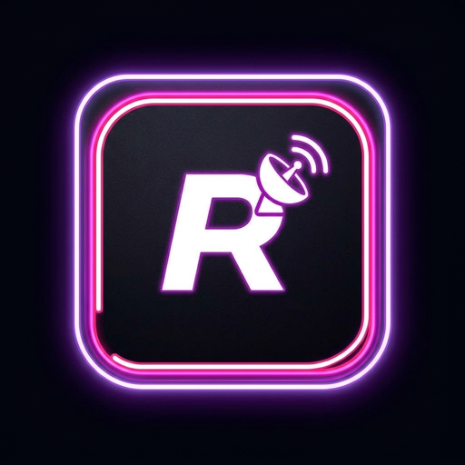
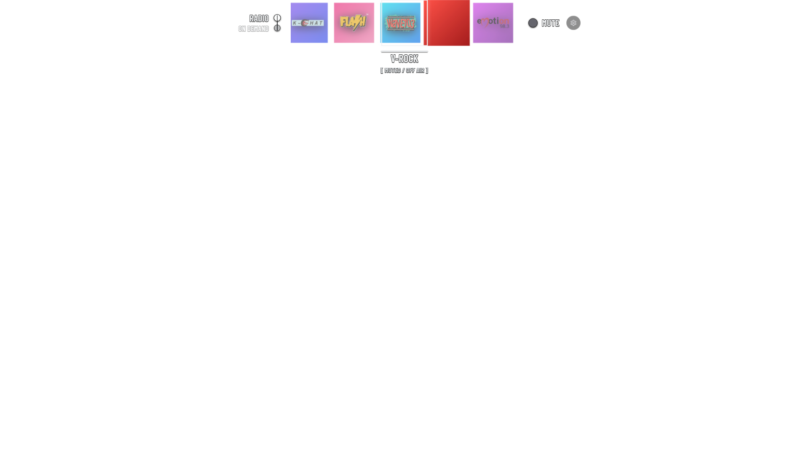
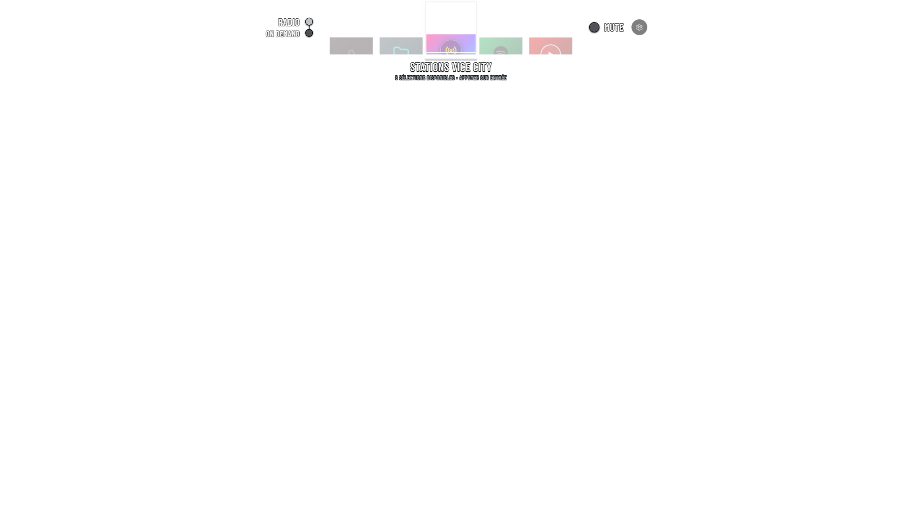
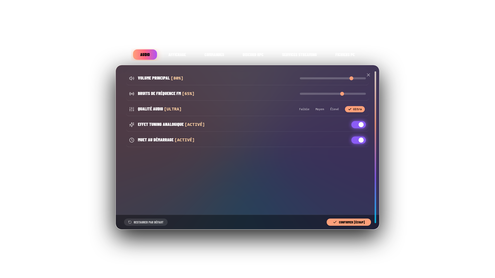
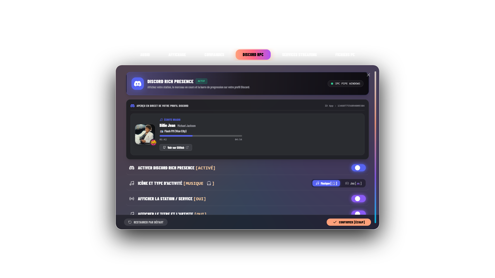

<div align="center">



# RRadio

**A transparent gaming radio overlay and On-Demand audio player for Windows.**

[](LICENSE)
[](https://www.microsoft.com/windows)
[](https://tauri.app)
[](https://react.dev)
[](https://www.rust-lang.org)
[](#)

[Download Installer](#install-and-run) • [Keybindings](#global-hotkeys) • [Contributing](CONTRIBUTING.md) • [Legal Disclaimer](DISCLAIMER.md)

</div>

---

> [!WARNING]
> ### Important Legal Notice and Non-Affiliation Disclaimer
> **RRadio is an independent, non-commercial fan project created solely for educational, research, and cultural preservation purposes.**
>
> - RRadio is **not** affiliated with, authorized, maintained, sponsored, or endorsed by **Rockstar Games, Inc.**, **Take-Two Interactive Software, Inc.**, **Google LLC**, or any of their affiliates.
> - "Grand Theft Auto", "GTA", "Vice City", and all station names and logos are registered trademarks of Take-Two Interactive Software, Inc.
> - **No copyrighted audio files or game files are bundled with this repository or installer.** Audio streams on the fly from public web archives and personal streaming accounts.
> - **Notice of Ephemeral Status**: Because this fan project exists in an intellectual property grey zone, this repository or project may be taken down or deleted at any time upon request from valid rights holders.
>
> For full details, please read our [Legal Disclaimer](DISCLAIMER.md).

---

## Overview

RRadio brings the Vice City radio dial straight to your Windows desktop. Designed specifically for gaming and multi-monitor setups, it acts as a lightweight, floating transparent HUD that you can summon instantly with a hotkey.

<div align="center">
  
  <p><em>The Vice City station wheel overlay running smoothly over Windows.</em></p>
</div>

### Why RRadio?

- **True Game Focus Preservation**: The HUD uses native Windows API flags (`WS_EX_NOACTIVATE` and `WS_EX_TRANSPARENT`). It never steals keyboard focus and never alt-tabs you out of full-screen borderless games.
- **Instant Radio Tuning**: Switch seamlessly across 8 classic radio stations with procedural analog static sound effects.
- **On-Demand Music**: Drill down into YouTube Music playlists and mixes directly from the wheel without opening a browser tab.
- **Discord Rich Presence**: Broadcast live track titles, album cover art, and real-time progress bars to your Discord profile.

---

## Visual Tour

<table align="center">
  <tr>
    <td width="50%" align="center">
      
      <br />
      <strong>On-Demand Drilldown Navigation</strong>
      <br />
      <em>Select from streaming providers, curated mixes, and your personal playlists with smooth slide animations.</em>
    </td>
    <td width="50%" align="center">
      
      <br />
      <strong>Glassmorphic Settings Dialog</strong>
      <br />
      <em>True backdrop blur with real-time audio volume control, hotkey remapping, and OAuth account connection.</em>
    </td>
  </tr>
  <tr>
    <td colspan="2" align="center">
      
      <br />
      <strong>Discord Rich Presence Integration</strong>
      <br />
      <em>Displays active track details, station badges, and live progress bars under Discord Listening activity.</em>
    </td>
  </tr>
</table>

---

## Global Hotkeys

Control playback and visibility from anywhere on your PC, even while inside another game or application:

| Action | Primary Hotkey | Alternative Hotkey | Push-to-Show Key |
| :--- | :--- | :--- | :--- |
| **Summon / Hide Radio HUD** | `F8` | `Alt + V` | Hold `Alt + Q` or `Alt + A` |
| **Mute / Unmute Audio** | `F9` | `Alt + M` | — |
| **Open On-Demand Menu** | `F7` | `Alt + O` | — |
| **Open Settings Dialog** | `F10` | `Alt + S` | — |

> [!TIP]
> The overlay starts muted by default so it never blasts unexpected sound. You can toggle default startup muting in the Settings menu (`F10`).

---

## Radio Stations

RRadio streams 8 classic stations with continuous playback emulation:

| Station | Genre | Description |
| :--- | :--- | :--- |
| **Flash FM** | 80s Pop & New Wave | Pop anthems hosted by Toni. |
| **Wave 103** | Synth-pop & Post-Punk | Dark wave and synth-pop hosted by Adam First. |
| **V-Rock** | Heavy Metal & Hard Rock | High-energy guitar rock hosted by Cougar and Lazlow. |
| **Emotion 98.3** | Power Ballads | Romantic soft rock and power ballads hosted by Fernando Martinez. |
| **Fever 105** | Disco, Soul & Funk | Classic groove and disco hosted by Oliver "Ladykiller" Biscuit. |
| **Wildstyle** | Electro & Old School Hip Hop | Classic electro and hip hop hosted by Mr. Magic. |
| **Radio Espantoso** | Latin Jazz & Salsa | Traditional salsa, jazz, and mambo hosted by Pepe. |
| **K-Chat** | Talk Radio & Celebrity Interviews | Satirical talk radio hosted by Amy Sheckenhausen. |

---

## Install and Run

### Option 1: Download Pre-built Installer (Recommended)

1. Go to the [Releases](https://github.com/sofianebel/RRadio/releases) page.
2. Download the latest `RRadio_x64_en-US.msi` or setup `.exe`.
3. Run the installer and launch RRadio.

### Option 2: Build from Source

#### Prerequisites
- Windows 10 or Windows 11
- [Rust](https://rustup.rs/) (stable MSVC toolchain)
- [Bun](https://bun.sh/) (or Node.js 20+)
- Visual Studio C++ Build Tools

#### Steps

1. Clone the repository:
   ```bash
   git clone https://github.com/sofianebel/RRadio.git
   cd RRadio
   ```

2. Install dependencies:
   ```bash
   bun install
   ```

3. Run in development mode:
   ```bash
   bun run tauri:dev
   ```

4. Compile the release executable:
   ```bash
   bun run tauri:build
   ```
   The compiled executable will be located in `src-tauri/target/release/rradio.exe`.

---

## Project Protection and License

RRadio is licensed under the **GNU General Public License version 3.0 (GPL-3.0)** with additional terms under Section 7:

- **Strict Copyleft Protection**: Any public fork, modified version, or derivative software must remain free and open source under GPL-3.0. You may not re-license, close the source code, or sell this software as a proprietary product.
- **Trademark Reservation**: The name "RRadio", the application logo, and project graphic assets are protected trademarks of the project maintainers. No permission is granted to use RRadio trademarks to endorse or promote third-party forks.
- **Warranty Disclaimer**: Software is provided "as is" without warranty of any kind.

See the complete [LICENSE](LICENSE) text and the [Legal Disclaimer](DISCLAIMER.md) for full terms.
For any legal inquiries, trademark questions, or takedown requests, contact the maintainer directly at [Belkessa0102@gmail.com](mailto:Belkessa0102@gmail.com).

---

## Contributing

We welcome community contributions. Please review the following guides before submitting pull requests:

- [Contributing Guidelines](CONTRIBUTING.md)
- [Code of Conduct](CODE_OF_CONDUCT.md)
- [Security Policy](SECURITY.md)

---

<div align="center">
  <sub>Built with passion for radio preservation and seamless gaming UX.</sub>
</div>
