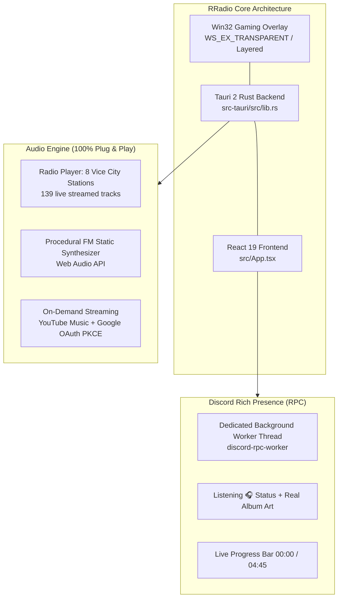

# RRadio - GTA 6 Radio Overlay for PC (Vice City Edition)
## Documentation de Passation / Agent Takeover

Ce document récapitule l'intégralité du projet, de son architecture, des fonctionnalités implémentées, des choix techniques et de la feuille de route pour tout développeur ou agent reprenant le projet.

---



---

## 1. Vue d'ensemble du projet

* **Nom** : **RRadio** (GTA 6 Radio Overlay for PC - Vice City Edition).
* **Objectif** : Fournir un overlay radio transparent, fluide et inaltérable par-dessus n'importe quel jeu PC (GTA 5, GTA 6, FiveM, Cyberpunk...), avec une roue de sélection inspirée des leaks de GTA 6, 8 stations complètes de Vice City, streaming On-Demand (YouTube Music) et synchronisation Discord Rich Presence en direct.
* **Stack Technique** :
  * **Backend** : Rust 2021, Tauri v2 (`rradio_lib`).
  * **Frontend** : React 19, TypeScript, Tailwind CSS, Framer Motion, Lucide Icons, Vite, Bun.
  * **Audio** : HTML5 Audio streaming, Web Audio API (synthétiseur de bruit FM), YouTube IFrame background player.

---

## 2. Architecture Native Windows & Overlay (Win32)

### A. Fenêtre Overlay transparente (`src-tauri/src/lib.rs`)
* Utilisation directe de l'API Windows `SetWindowLongW` avec les styles `GWL_EXSTYLE` :
  * `WS_EX_LAYERED` : active la composition alpha GPU.
  * `WS_EX_TRANSPARENT` : permet aux clics de traverser directement la fenêtre vers le jeu sous-jacent.
  * `WS_EX_TOOLWINDOW` & `WS_EX_NOACTIVATE` : n'interrompt jamais le focus clavier/souris du jeu.
* Intégration DWM (`DwmExtendFrameIntoClientArea` avec marges à `-1`) pour une transparence pure sans bordures ni artefacts.
* Commande `set_click_through(enable: bool)` :
  * Activée quand l'overlay est fermé (le joueur contrôle son jeu à 100%).
  * Désactivée quand la roue radio ou les paramètres sont ouverts pour permettre la navigation souris.

### B. Raccourcis Système Globaux (`RegisterHotKey`)
Thread Win32 dédié avec boucle `GetMessageW` écoutant les touches matérielles globales même quand un jeu tourne en plein écran exclusif :
* **F8 / Alt + V** : Ouvrir / Masquer la roue radio.
* **F9 / Alt + M** : Couper / Réactiver le son (Mute).
* **F10 / Alt + S** : Ouvrir le menu Paramètres.
* **F7 / Alt + O** : Basculer entre mode Radio et mode On-Demand.
* **Alt + Q / Alt + A** : Affichage temporaire au maintien (Push-to-Show via écouteur bas niveau `rdev`).

### C. System Tray (Zone de notification)
* Icône dans la barre des tâches près de l'horloge Windows.
* **Clic gauche** : Affiche / masque l'overlay immédiatement.
* **Clic droit** : Menu contextuel (`Afficher / Masquer`, `Couper le son`, `Paramètres`, `Quitter`).

---

## 3. Moteur Audio (100% Plug & Play)

### A. Les 8 Stations officielles de GTA Vice City (`src/data/stations.ts`, `src/data/radioManifest.json`)
* `flash_fm` : Pop & New Wave 80s (DJ Toni).
* `wave_103` : New Wave & Post-Punk (DJ Adam First).
* `v_rock` : Hard Rock & Heavy Metal (DJ Lazlow).
* `emotion_983` : Power Ballads & Soul (DJ Fernando Martinez).
* `fever_105` : Disco, Funk & R&B (DJ Oliver "Ladykiller" Biscuit).
* `wildstyle` : Electro & Old School Hip-Hop (DJ Mr. Magic).
* `espantoso` : Latin Jazz, Salsa & Mambo (DJ Pepe).
* `kchat` : Talk Radio & Interviews (Amy Sheckenhausen).

### B. Caractéristiques du streaming
* **139 pistes audio réelles** : Intros des DJ, morceaux complets et fausses publicités du jeu streamées directement en CDN haute vitesse (Archive.org) sans aucun fichier local requis sur le disque de l'utilisateur.
* **Simulation de direct permanent** (`calculateLiveStationPosition`) : Calcul d'époque pour que chaque station tourne en continu en tâche de fond. Quand le joueur zappe sur une station, il arrive au milieu d'un morceau en cours, comme sur un vrai autoradio.
* **Synthétiseur de parasites FM procédural** : Bruit blanc généré mathématiquement via Web Audio API (`AudioContext`, `BiquadFilterNode` passe-bande à 1400 Hz) joué pendant le zapping de station (durée de 200ms).

---

## 4. Mode On-Demand & Streaming YouTube Music

### A. Navigation à 3 niveaux (Drill-Down)
* **Niveau 1 (Services)** : Choix de la source (*YouTube Music*, *Spotify*, *Deezer*, *Apple Music*).
* **Niveau 2 (Playlists / Mixes)** : Choix de la sélection (Mix Curated, Titres Likés, Albums).
* **Niveau 3 (Queue / Morceaux)** : Liste des titres défilant avec sélection directe.
* Animation continue en ascenseur physique (smooth slide sans clignotement ni saut d'index).

### B. Authentification OAuth 2.0 PKCE Google (`src-tauri/src/oauth.rs`)
* Serveur loopback local en Rust écoutant sur port dynamique pour capturer la redirection Google OAuth en un clic sécurisé.
* Lecteur d'arrière-plan invisible YouTube synchronisé avec les contrôles de volume et de saut de piste.

---

## 5. Module Discord Rich Presence (RPC)

### A. Architecture résiliente et non-bloquante (`src-tauri/src/discord.rs`)
* Dépendance : `discord-rich-presence = "1.1.0"` via le socket IPC Windows local (`\\.\pipe\discord-ipc-0`).
* **Isolation complète** : Toutes les connexions et transmissions passent par un thread OS dédié (`discord-rpc-worker`) via un canal Rust non-bloquant `std::sync::mpsc::sync_channel`.
* Les commandes Tauri `update_discord_activity` et `clear_discord_activity` s'exécutent en moins de 1 microseconde sans jamais bloquer l'interface ni les raccourcis clavier.
* **Sécurité anti-gel** : Période de backoff automatique de 8 secondes en cas d'erreur de socket ou si Discord est fermé pour éviter de saturer le pipe Windows.

### B. Affichage sur le profil Discord
* **Type d'activité** : Mode Écoute musicale 🎧 (`ActivityType::Listening`). L'icône de manette verte 🎮 est remplacée par la note de musique 🎵 et le texte « *Listening to RRadio* ».
* **Grande Jaquette** : Vraie pochette de l'album officiel du morceau en cours d'écoute ($600 \times 600$ JPEG servi par Apple CDN via `src/data/trackCovers.json`).
* **Badge d'angle** : Pochette officielle de la station radio écoutée.
* **Barre temporelle interactive** : `00:00 ━━━━●━━━━ 04:45` calculée avec `start_timestamp` et `end_timestamp`, avec défilement fluide et remise à zéro synchrone à chaque changement de piste.
* Bouton cliquable direct vers le dépôt GitHub du projet.

---

## 6. Structure des Fichiers Clés

```
RRadio/
├── src/
│   ├── App.tsx                     # Orchestration centrale, état audio, raccourcis, sync Discord
│   ├── audio/
│   │   ├── radioPlayer.ts          # Moteur de lecture live FM & On-Demand, calculs d'époque
│   │   ├── soundEngine.ts          # Bruits de clics mécaniques rétro
│   │   └── youtubePlayer.ts        # Wrapper YouTube IFrame API invisible
│   ├── components/
│   │   ├── RadioWheel.tsx          # Roue HUD de sélection radio (style GTA 6)
│   │   ├── StationLogo.tsx         # Rendu des 8 logos vectoriels transparents
│   │   ├── SettingsDialog.tsx      # Menu des paramètres Glassmorphism (Beige/Violet/Pêche)
│   │   └── ProviderCard.tsx        # Cartes des services de streaming
│   ├── data/
│   │   ├── stations.ts             # Métadonnées des 8 stations, logos et pochettes
│   │   ├── radioManifest.json      # 139 URLs audio Archive.org des stations
│   │   ├── trackCovers.json        # 51 pochettes officielles des albums de Vice City
│   │   └── ondemandProviders.ts    # Définition des services streaming et mixes
│   ├── types/
│   │   ├── radio.ts                # Modèles RadioStation, Track, RadioState
│   │   ├── ondemand.ts             # Modèles OnDemandProvider, Playlist, Track
│   │   └── settings.ts             # Configuration AppSettings et DiscordRpcConfig
│   └── utils/
│       ├── settingsStore.ts        # Sauvegarde/chargement localStorage
│       └── tauriBridge.ts          # Pont IPC entre React et le backend Rust
├── src-tauri/
│   ├── Cargo.toml                  # Dépendances Rust (tauri v2, discord-rich-presence, windows...)
│   ├── tauri.conf.json             # Configuration Tauri v2 (fenêtre transparente, tray icon)
│   └── src/
│       ├── lib.rs                  # Point d'entrée Rust, boucle Win32 WM_HOTKEY, click-through
│       ├── discord.rs              # Worker thread IPC Discord non-bloquant
│       └── oauth.rs                # Serveur loopback local OAuth 2.0 PKCE Google
└── takeOver/
    └── PROJECT_RECAP.md            # Ce document
```

---

## 7. Commandes Utiles & Développement

### Lancer en mode développement :
```bash
# Terminal 1 ou commande directe Tauri :
cargo tauri dev
```

### Compiler le frontend seul :
```bash
bun run build
```

### Compiler le binaire natif de développement :
```bash
cargo check --manifest-path src-tauri/Cargo.toml
cargo build --manifest-path src-tauri/Cargo.toml
```

### Compiler le binaire de production standalone :
```bash
cargo build --release --manifest-path src-tauri/Cargo.toml
# L'exécutable standalone est généré dans :
# src-tauri/target/release/rradio.exe
```

---

## 8. Liste des choses à faire pour finaliser la publication (Roadmap)

1. **Créer le fichier `.gitignore`** :
   * Exclure `node_modules/`, `src-tauri/target/`, `dist/`, `.env*`, `extracted_frames/`.
2. **Définir l'ID Discord par défaut** :
   * Remplacer `applicationId: '1346077556094009384'` dans `src/types/settings.ts` par le Client ID de production vérifié pour que Discord RPC soit 100% plug & play dès le téléchargement.
3. **Créer le `README.md` principal** :
   * Visuel et accessible aux joueurs avec badges, captures d'écran, tableau des raccourcis et lien de téléchargement direct de l'exécutable.
4. **Compiler le binaire release final** :
   * `cargo build --release --manifest-path src-tauri/Cargo.toml`.
5. **Initialiser Git et publier le dépôt** :
   ```bash
   git init
   git add .
   git commit -m "feat: initial release of RRadio GTA 6 overlay"
   git remote add origin <URL_DU_REPO>
   git push -u origin main
   ```
